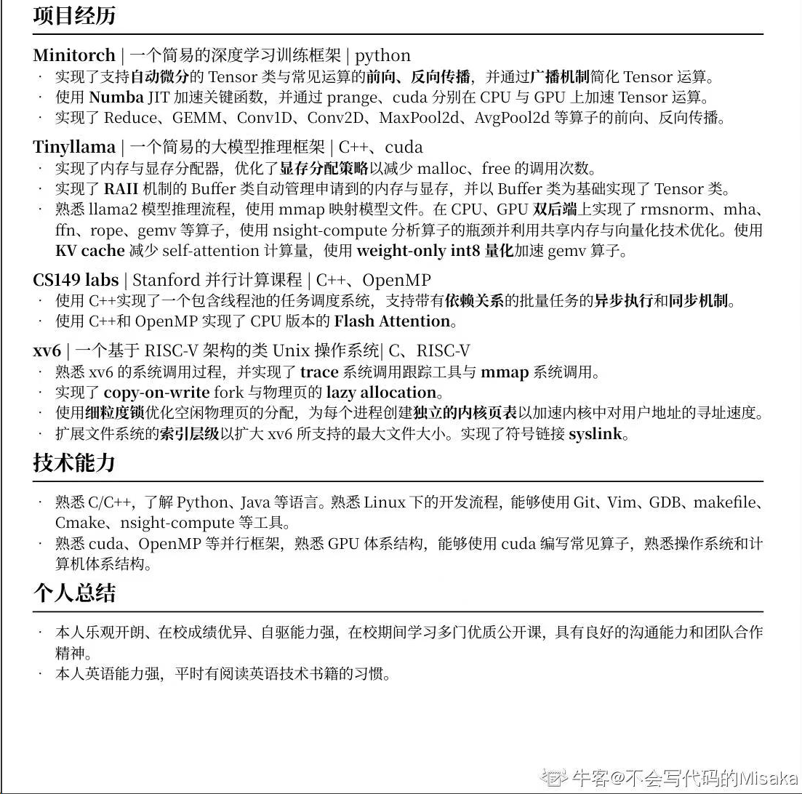

应用：有AI应用相关开发经验，了解 LLM 架构，熟悉PE工程、AI Agent、LangChain、RAG、Memory、Text2SQL等技术者优先； 

推理研发，[字节](https://jobs.bytedance.com/campus/position/7480382122965469447/detail?utm_device=pc&utm_keyword=qz2024pc008&utm_source=SEMbaidu)：3、了解Kubernetes架构和生态，熟悉Docker/Containerd/Kata/Podman等容器技术； 了解至少一种主流的机器学习框架/推理引擎，有大模型推理性能优化经验；有大模型资源调度/服务编排的落地经验，参与过大规模分布式系统的设计、开发和维护；了解GPU系统/体系结构；

[腾讯推理](https://careers.tencent.com/jobdesc.html?postId=1810213739450867712)：熟悉主流大模型推理框架，如vllm，lightllm，tensorrt-llm，lmdeploy，faster transformer等；熟悉CUDA，triton（https://openai.com/research/triton）、cutlass至少一种以上，精通者优先；熟悉大模型结构，了解大模型性能瓶颈，熟练分析单机及分布式情况下不同性能热点和优化手段；熟悉大模型量化算法，int8/fp8/混合精度量化，了解模型蒸馏、稀疏化、剪裁技术；熟悉推理服务框架，具备服务部署经验者优先，了解k8s，容器化服务，Triton Inference Server (https://github.com/triton-inference-server/server)实现原理者优先；熟悉分布式模型部署及并行策略，如模型并行、流水线并行等，了解NVLINK、GPU通信者优先；了解GPU体系结构者优先。

https://www.bilibili.com/video/BV1VXNjegE1P/?spm_id_from=333.788.videopod.sections&vd_source=226da368954a7c68d6b7e4bbdc91b2cd

# 🧑‍💻赵勇臻

（+86）181-6810-0075｜ [zhaoyzzz@outlook.com](mailto:zhaoyzzz@outlook.com)

出生年月：2002.3.22 | 籍贯：甘肃庆阳

## 简介

## 教育背景

**南京大学 - 硕士 - 软件工程专业（2024.09-2026.07）（推免）**

**南京大学 - 本科 - 软件工程专业（2020.09-2024.07）**

## 实习经历

**腾讯 - CSIG - TRTC -（2025.06 - ）**

**网易 - 伏羲 - 后端系统开发 -（2023.06 - 2023.09）**

AOP（Agent-Oriented-Programming，面向智能体编程）是网易伏羲设计的一套全新的编程范式，用户可以通过该框架调用智能体服务。我主要负责项目自用序列化框架 DDL 模块的开发，并采用**测试驱动开发（TDD）**和**类型驱动开发**等技术，确保了代码的高质量和可维护性。主要工作如下：

- **功能开发：**扩展 DDL 模块的功能，新增对多种复杂数据类型的支持同时，为项目引入 type hints， 结合 mypy 进行静态类型检查，有效提升了代码的可读性、可维护性和类型安全性，减少了运行时错误的发生概率。
- **性能分析：**开发性能分析脚本，利用火焰图进行性能分析，定位了关键性能瓶颈。
- **完善测试：**基于 Property-Based Random Testing 思想**，**完善了 DDL 模块的测试，将覆盖率提升至 90%。
- **性能优化：** 采用了多种优化方法提升了 DDL 的性能。在优化之前 DDL 序列化平均耗时在 protobuf 的50倍左右，优化后在大部分典型场景下性能与原生 protobuf 相差在2倍以内，部分场景为 protobuf 的四分之一不到。

## 项目经历

**Transformer-LM**

**Needle**

**SysY-RISCV 编译器 -（2024.07 - 2024.09）**

- 使用 C++17 完成了一个高性能编译器。
- 基于 SSA IR 实现了多种优化，性能表现达到 **GCC O2 水准**。
- 负责编译器后端开发并担任组长，锻炼了**团队协作和领导能力**，加深了对编程语言的认识。

**miniOS 操作系统 -（2022.03 - 2022.06）**

- 使用C语言实现了一个支持多处理器的操作系统。
- 在实现内存分配器的过程中，分别实现了基于链表的，基于红黑树的，和基于 slab 的内存分配器，深刻理解了“**Fast Path，Slow Path**”相结合的系统设计原则。
- 在实现内核多线程的过程中，理解了并发的基本理论，认识到在并发编程中“**防御式编程**”的重要性。

## 专业技能

- **基础知识**：熟悉计算机网络、操作系统和编译原理等方面基础知识。
- **编程语言**：对 Java 和 Python 语言比较熟悉，也有 Rust 和 C++ 开发经验。
- **后端框架**：熟悉 SpringBoot。也能快速上手其他 Web 框架。
- **技术分享**：在博客 https://rzyn2020.github.io/ 中进行一些技术分享。
- **语言能力**：英语（CET6），能熟练阅读英文文档和书籍，观看英文技术视频。

---

https://logikosto.feishu.cn/wiki/ECArwdRwEi1LVgknksZcoV9inxc

---

